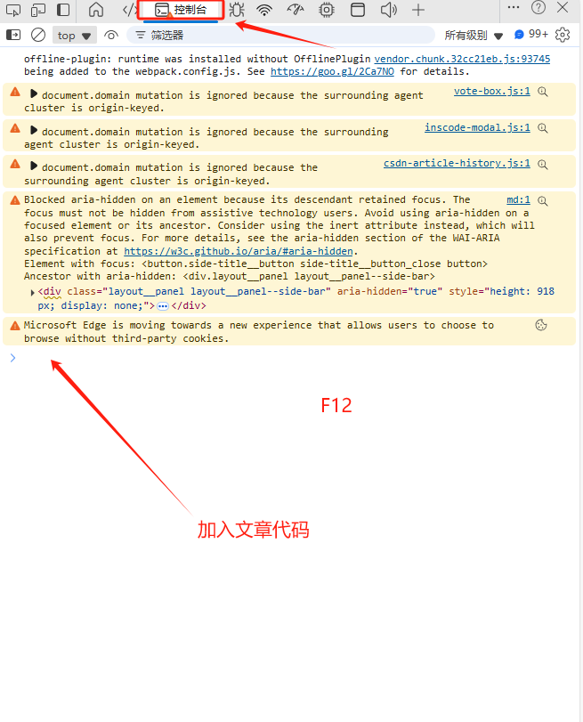

# 抖音点赞自动取消工具

一个用于批量取消抖音点赞的浏览器脚本工具。
使用过程中抖音内存池有缓存延迟，所以需要等待片刻可以在手机端看看取消的进度。

## 功能说明

- 自动从浏览器 localStorage 中提取抖音安全密钥
- 每 4 秒自动获取并取消点赞列表（每次最多 999 个）
- 实时显示取消进度
- 支持多个密钥存储位置自动识别

## 使用方法

1. 在浏览器中打开抖音网站并登录
2. 打开浏览器开发者工具（F12）
3. 切换到 Console（控制台）标签
4. 复制 [douyin-auto-unlike.js](douyin-auto-unlike.js) 文件中的全部代码
5. 粘贴到控制台并按回车执行
6. 脚本会自动开始取消点赞，页面中央会显示蓝色进度提示框
7. 如需停止，直接关闭浏览器标签页即可

## 技术细节

**语言**: JavaScript（浏览器端）

**核心功能**:
- 从 localStorage 读取安全密钥（`ec_privateKey` 和 `ec_publicKey`）
- 调用抖音 API 获取点赞列表
- 批量调用取消点赞接口
- DOM 操作显示实时进度

**支持的密钥存储位置**:
- `security-sdk/s_sdk_cert_key`
- `security-sdk/s_sdk_crypt_sdk`

## 注意事项

⚠️ 本工具仅供学习研究使用，请遵守抖音平台使用规则
⚠️ 频繁操作可能触发平台风控机制
⚠️ 使用前请确保已登录抖音账号
